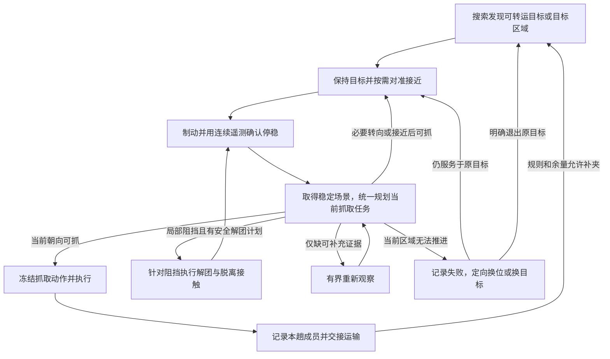

# 2315 现场日志：根因与重构方案

本文记录 `logs/match_20260912_2315.log` 的事故分析与待实施方案，不表示重构已经完成。
现行流程权威仍是 `docs/正式流程设计.md`；实施后应将最终契约更新到该文档并删除被替代的描述。

## 结论

应统一重构搜索、目标接管、对准接近、静止规划、近场抓取、补夹以及解团恢复的整条链路，以完成抓取为唯一主线。解团是为当前抓取任务解除阻挡的恢复动作，完成后回到该任务的抓取规划。当前代码把运动中选组、实际停稳、异步准备、锁组确认、结果时效和失败重选分散在多个相互调用的状态机中。
“停车后用一张可靠稳定帧作决策”没有成为系统契约，因此增加局部超时、确认或重选分支无法消除循环。
上一轮扩大相邻物资等待的修改还引入了实际回归：只验证增组机械可达，没有证明增组路径合法，可能扣住原本可执行的单块方案。

不能把所有拒绝都删除：日志有蓝色目标缺几何和实际扫掠阻挡。错误是把这些拒绝包装成重复等待、原地重选；正确行为是用当前完整证据选择另一个合法动作，或完成有界重新观察/换位。

## 现场证据

| 日志位置 | 事实 | 说明 |
| --- | --- | --- |
| 第 2 行 | 单次确认 1 帧、观察年龄 800 ms、提交年龄 150 ms、无计划等待 800 ms、近场提交预算 1800 ms | 多种不同时间语义仍依赖互不一致的年龄门槛 |
| 第 33 行，约 4.039 s | 已进入近场等待，`stationary_since=none`，gyro_z=1.109 rad/s | 观察预算已经开启，但车辆还没真实停稳 |
| 第 71、74、80 行，约 10–12 s | 转向后停车，随后 `waiting_perception_delivery`、frame=None，最终解团超时 | 输入过期会被上游变成 None；None 不能直接解释成相机没有工作 |
| 第 710、738、764 行，143–148 s | 里程均为 3.29222375 m、航向均为 -2.30446638 rad，近场 session 从 38 变成 40、42 | 已停车仍反复清会话，不是靠“再停一次”能够解决 |
| 第 721、748、774 行 | 计划采集年龄分别约 1485.7、1060.2、952.7 ms；最后均等待并超时 | 候选规划已经返回，但年龄门禁先于静止例外过滤了它 |
| 第 837、858、879、902 行 | 四次重复选择同一个入口 track=52 | 失败记录数增加不等于同一入口被正确封锁 |
| 第 724、750、775 行 | 控制周期窗口 P95 分别 123.4、104.9、93.7 ms；最大值最高 164.3 ms | 实际生产节拍不满足理想 5–10 ms 轮询条件 |
| 第 438 行 | 一次 `near_field_result`，单绿，capture_confirmed=False | 日志仅能证明软件动作完成，不能当作真实接触确认 |

全日志有 15 条解团失败记录，均为参考确认超时；6 次近场确认超时退出的状态切换。
按约 1 秒采样的状态持续估计，约 71.6 秒位于 `breakup_settle`；这只是采样近似，不是精确性能统计。
85 个感知统计窗口的 P50 的中位数约 322.0 ms，P95 的中位数约 407.9 ms；这些不是所有帧的合并分位数。
某些窗口感知处理本身接近 800 ms，叠加准备器计算后，出现超过 1 秒的计划年龄并不意外。

## 可直接复现的代码矛盾

### 1. 停车窗口由定时器开启，实际静止证据到最后才检查

`MatchSequence.near_field_observation_window_open()` 只检查 action settle 是否到期。
`GripperWidthPickupSequence.step()` 在提交前检查静止采集，但在这之前可以锁组并根据 `alignment_angle_rad` 旋转。
`_collect_dynamic_breakup()` 也会先根据提案旋转，停车后的新规划又可能改变提案并再次旋转。

本地实调用复现：持续注入有效但仍在转动的 IMU 样本，静止起点为 None，近场 observation window 仍返回 True。
这不是“必须边运动边判断新鲜度”的物理要求，是控制权顺序错误。

### 2. 一帧确认配置掩盖了两次视觉往返

准备器 `GraspPreparationSession.update()` 只有在 `locked_ids` 非空时才累计 ready；首次无锁选组只返回候选。
执行器拿到候选后再反馈锁组，worker 的 submit 又按采集时间去重；相同帧不能在锁组后继续完成确认。
session 自身也会对相同 frame_sequence 直接返回旧结果。

本地实调用复现：confirmation_frames=1；首次结果 plan=(1,)、ready=False；同一稳定帧带 locked_ids=(1,) 再调用，仍为 ready=False、checked_member_ids=None。
因此当前契约实际要求另一张图，而不是一次稳定场景的完整决策。

### 3. 静止几何例外被更早的年龄门禁挡住

`GripperWidthPickupSequence.step()` 一开始就按 `now - prep.capture_timestamp_ns <= age_ns` 过滤准备结果。
后面的 `_stationary_plan_valid()` 无法挽救已被过滤的结果。
生产入口还先用 `renderer.latest_fresh_snapshot(..., 800 ms)` 把结果变成 None；`MatchSequence.step()` 再把 None 写入 `_latest_perception`。
这使“通用视觉流过期”和“当前静止动作的场景证据失效”混成一件事。

本地实调用复现：机器人从 10 ms 起持续有静止遥测证据，100 ms 采集，1100 ms 刚发布的已确认计划（发布年龄 0 ms），结果为 waiting_eligible_group。
这个实验说明拒绝发生在检查真实有效性之前；并不意味着可以无限期沿用旧场景。

### 4. 上一轮新增等待会为了不合法的增组方案扣住合法单块

`NearFieldGraspSelector.select()` 的等待分支只调用 `_build()` 检查开度、行程和容量，没有完整检查增组后的危险扫掠。
本地实调用复现：绿块 (300,0)，待确认绿块 (300,70)，蓝块 (320,120)，单位 mm。
同伴未确认时输出 waiting_adjacent_supply_confirmation、plan=None；同伴确认后，完整选组拒绝增组并选择原先的单块 (1,)。
说明此前那段等待没有产生可执行收益。这是上一轮修复引入的明确缺陷。

### 5. 失败记录没有统一绑定本次入口与动作核心

主 tracker、局部 tracker、handoff prior、preview_plan 和 active_plan 可能指向不同对象。
`_near_field_route_decision()` 获得候选计划时清空 handoff prior；失败记录优先从 selection.plan 或 preview_plan 取核心。
结果可能记录了局部备选组合，却允许原入口马上再次进入；另一些路径重复记录同一次失败。
日志在 session 38/40/42 及 track=52 的重复接管直接证明：当前失败记忆没有建立“不换位不重试同一次失败动作”的整体约束。
具体一次失败究竟记录了哪个空间对象，还需记录完整入口/核心映射；不能仅靠 failure_records 数量推定正确。

### 6. 重计算和日志竞争没有纳入生产验证

解团规划仍由控制路径直接调用；近场准备在后台线程做组合枚举、机械可达角搜索和几何检查，诊断也计算几何。
“放在另一个线程”不等于控制线程获得确定执行时间。日志已经证明高负载时控制周期出现百毫秒长尾；各部分的具体占比需要目标设备剖析，不能仅凭日志归因于某一个线程。
静止证据要求设备样本连续、编码器不动和有效 IMU；日志中的零速和 gyro=0 不能证明期间没有样本断档、无效位或编码器变化。
目前缺少静止证据失效原因，不能声称这些重置全是误判。

## 根本方案：以抓取任务统一整条物块处理链

统一范围包括搜索、目标选择与保持、对准、远场接近、停稳观察、近场选组、抓取执行、补夹和解团恢复。
这些阶段由同一个抓取任务编排器拥有目标、进度和退出权；几何规划器只返回动作与证据，不自行跳回搜索或创建新会话。
复用现有 K0、物理包络、扫掠和规则算法，移除被替代的独立路由、锁组握手和重复计时逻辑。

完成一次抓取并交接运输，或有明确原因退出当前物理目标，才结束当前抓取任务。
搜索服务于发现值得抓取的目标；接近服务于取得可执行几何；解团服务于解除当前抓取障碍。
“完成一次解团”“转完一圈”“重新进入近场”都不能单独视为任务成功。
安全区运输与交付继续由比赛任务层管理，本次重构统一的是抓取链及其与运输的明确交接。

### 任务生命周期

图中的回边不能重置抓取任务总截止时间、已尝试的物理动作和恢复进度。
成功抓取后的补夹可创建下一次抓取任务，但必须继承本趟已携带成员、剩余容量、累计扫描预算和未解除的物理失败记录。
所有无解出口必须说明下一步怎样改变几何或证据；不允许仅换 session 后重跑同一动作。

### 一个任务持有的连续上下文

| 上下文 | 生命周期与用途 |
| --- | --- |
| 抓取任务身份、入口目标及其物理位置/目标区域 | 跨搜索接管、接近、停稳、解团和再抓取保持；局部 track ID 只作为关联线索 |
| 当前抓取核心与可共同收拢成员 | 核心稳定时，外围闪烁或排名改变不能清空进度；抓取组合按规则和真实可达性确定 |
| 原始观测、采集位姿、静止区间、感知及规划发布时间 | 分开保存时间语义，支持运动补偿和延迟结果消费，不改写采集时间 |
| 当前阻挡及恢复目的 | 记录哪个目标/接触区挡住哪段抓取路径，解团需要打开什么通道或解除什么接触 |
| 当前冻结动作及场景修订标识 | 只消费属于当前任务、当前有效场景的结果；迟到的旧恢复/抓取计划不能接管新阶段 |
| 本趟已携带成员、剩余容量及任务规则 | 搜索、直接抓取、解团后重选和补夹共用，不能因局部状态切换重新计数 |
| 总截止时间、已用转向/恢复机会与物理失败记录 | 不因状态或 ID 变化清零；恢复必须有实际进展才能继续 |

继续沿用现有跟踪与采集位姿补偿权威。实施时先核对可复用目标记忆模块的调用契约，不另建一套坐标变换或平行 tracker。

“不丢目标”指不因软件交接、短暂漏检、局部重编号或准备结果迟到而忘记正在处理的物理目标。
短时失观时保留近期可靠位置与不确定性，依据已验证路径选择短程继续、限速或定向重新观察，不能立即清空目标并自由扫场。
实际目标消失、类别/位置关联不可靠或当前关键几何无法支持动作时，必须显式退出或恢复；不能把记忆位置当作当前精确抓取证据。

### 搜索与接近直接服务于抓取

- 搜索同时考虑合法单块与绿黑组合，近场优先，远场合法目标仍可接近。发现候选即接管，不要求先完成一圈或先达到成团数量。
- 选中入口时保留可用候选场景与物理身份，接近阶段持续用采集位姿补偿更新同一目标。进入近场不重建身份、重新从零确认类别或丢弃已返回结果。
- 近场实际可达时立即制动取稳定场景；远场采用有界运动与粗对准进入可抓范围，不边微调边重做近场精规划。
- 接近途中已有局部阻挡证据时，由当前抓取任务选择安全绕行/换位或解团恢复；不通过“接近失败→自由搜索→重新选中同一目标”绕回原点。
- 未执行动作前可以根据当前完整场景选择明显更可执行的替代；一旦冻结转向、接近或抓取动作，外围候选排名变化不能抢夺控制权。
- 已交付和已携带成员在所有候选入口统一排除，但仍保留必要的障碍、危险和推移净空证据。

### 静止规划的决策顺序

同一可靠场景只完成一次必要的几何构建。规划先回答“怎样抓到”，再决定是否需要恢复，按以下顺序给出可执行结果：

| 当前证据 | 抓取任务下一步 |
| --- | --- |
| 当前朝向存在合法抓取方案 | 直接冻结执行；在完整检查通过的方案中优先多抓，不能为不可执行的增组扣住合法单块 |
| 必要的转向/短程接近可形成合法抓取 | 冻结实际所需动作，以 IMU/编码器执行；随后停稳复核同一核心 |
| 当前核心受阻，但同一场景已有其它可直接抓取目标 | 直接选择合法替代并显式更新任务核心，保留原目标失败记录 |
| 可靠场景中抓取无解，且阻挡可通过安全接触/推移解除 | 在同一任务内进入针对性解团，不继续占用抓取确认预算等待 |
| 仅缺下一帧可能补齐的几何或关联证据 | 保持停车进行帧级、有界重新观察；到期立即选择已有安全恢复动作或退出当前区域 |
| 解团自身也缺关键接触/危险几何，或不能安全改善抓取条件 | 不盲推；定向换位获得有效视角/通道，或明确换目标 |

“无法决定抓取”不能被笼统解释为继续等待。已有可靠阻挡证据时直接规划解团；缺证据时，短观察窗口到期后也必须进入有证据支持的恢复或退出。
解团的安全性不能从“抓取失败”推导出来，仍须独立验证真实接触点、夹爪前伸、危险物实体范围、完整路径和场界。

### 解团是抓取任务的恢复步骤

每个解团方案必须带有本次抓取的阻挡证据、接触核心、期望改善和完成后的抓取接回位置。
例如：为目标 K0 的接近通道打开净空、解除夹爪前端穿入，或使紧密物块能够形成规则允许的组合。
规划需要证明接触/推移动作有依据且路径合法；不能要求精确预测摩擦碰撞后的每块最终坐标，也不能只因为看见一个团就启动解团。

解团执行后只退到解除接触、恢复可观察/可抓取的位置，停稳后优先复核原目标或其物理目标区域。
解团会真实改变物块位置，因此保留任务意图与关联线索，作废受推移影响的旧抓取几何；必须以新稳定场景重新关联并规划，不能直接执行解团前缓存的抓取轨迹。
目标 ID 改变不触发自由搜索；原目标确实不再可抓时，可接管恢复后出现的合法目标，并明确记录该替代。

恢复效果以抓取条件是否改善衡量：通道是否打开、穿入是否解除、是否出现可执行单块/组合。
恢复成功就立即回到抓取规划，不追加整圈扫描或无目的的第二轮解团。
没有改善则保留失败核心与位姿，禁止相同几何下重复相同推移；只能采用经验证的不同恢复动作、真实换位或换目标。
解团次数与恢复路径累计受当前抓取任务预算约束，不能通过“退出解团再进入抓取”恢复次数。

### 停稳、规划和执行的统一契约

1. **停车后再精规划。** 制动和等待停稳期间不发微调转向。只有真实静止证据成立后才能接收精规划场景；固定等待时间不替代静止证据。
2. **稳定场景独立保存。** 一般视觉流缺一次新结果不清空任务场景。若跨阶段始终静止且已有场景仍有效，就复用已有静止起点和场景，不再等待“进入新状态之后”的图像。
3. **一帧一次完整决策。** 目标关联、抓取选组、机械开度、规则和完整路径检查在同一个场景任务中完成；配置为 1 帧时不再由消费者锁组后追要第 2 帧。需要多帧时由唯一证据阶段管理，重复读取不计数。
4. **同场景复用恢复依据。** 抓取无解后，解团规划复用同一场景的几何与具体拒绝原因，不另开感知会话、清目标或重复构建几何。只有真实运动/推移、证据失效或新的明确风险才要求对应的新场景。
5. **结果返回即可消费。** 不要求规划返回同时有新图。按任务和场景身份、采集后的真实运动、核心可靠性、当前风险及有界观测失联判断有效性，不用短于正常处理时延的门槛先行丢掉结果。
6. **冻结动作独占执行。** 必要转向按 IMU 进度完成，前进/后退按编码器完成；执行期间新帧供风险监视与后续场景准备，不能重排当前动作。迟到帧不能消耗新修正机会。
7. **失败一次记录一次。** 先记录入口、实际动作核心、失败类型、尝试位姿与重入条件，再释放局部计划；不允许 preview 的其它成员覆盖正在尝试的入口身份。
8. **抓取与恢复共用风险边界。** 首轮单绿、伤员单独转运、容量、危险、场界、急停和关键控制状态贯穿整链。携带状态下只启用已经验证允许的恢复动作；不因统一编排自动开放带载解团，必要时结束补夹交接运输。

### 延迟和时间预算

抓取任务从选择物理目标开始持有总截止时间，跨对准、接近、停稳、解团恢复和再抓取不重置。
分别记录实际运动、制动/停稳、等待可靠采集、规划计算和恢复执行的耗时，子阶段预算受任务剩余预算约束。

无计划的短观察窗口从真实停稳且已请求可靠场景开始，不从车辆尚在转动时开始；窗口按合理帧间隔与处理延迟取帧级尺度。
它短于且独立于可成立计划的确认预算。可靠场景已经证明抓取无解，就立即进入安全恢复决策，不等待窗口用完；已经完成的异步规划结果也不属于“还没有计划”。

每次交接传递上下文与证据，不串接新的身份确认、固定延时或停车窗口。
无新运动且现有静止证据持续有效时直接推进；真正发生运动或解团推移后再取得必要的新稳定场景。
同帧去畸变、包络、坐标补偿和完整 BEV 按需复用；可执行抓取计划已成立时，不为寻找理论最优组合重复进行边界搜索。

任务退出日志必须报告阶段、目标/核心、阻挡、最近实际进展、确认次数、采集年龄、静止起点、准备年龄、阶段及任务截止时间和具体下一步。
不通过普遍增大 timeout 或观测年龄掩盖多次握手、重复规划和会话清零。

### 模块调整范围与迁移顺序

1. **统一任务上下文与决策出口。** 从 `match.py` 收拢搜索、候选接管、对准接近、近场、补夹和解团恢复的控制权；删除各自跳回自由搜索和重开会话的旁路。搜索策略只能提出候选，规划器只能返回建议，任务编排器统一提交动作与更新进度。
2. **统一物理目标关联与失败归属。** 在现有跟踪和采集位姿历史上建立贯穿整链的映射，处理主/局部 ID、短时失观、解团后的真实位置变化及携带排除。先落实此契约，再迁移动作，避免换框架后继续丢目标。
3. **统一场景请求与规划结果。** `GraspPreparationSession/Worker` 改为固定场景的一次请求/一次结果；抓取优先，必要时在同一任务中调用 `breakup_planner.py`。结果明确为抓取、必要运动、解团恢复、短观察或退出原因；不通过字符串猜测“timeout 应该去哪”。
4. **执行器只执行。** `GripperWidthPickupSequence` 与解团执行路径消费已冻结的动作，不自行选组、重开观察预算或启动搜索。`motion/stationary.py` 保持唯一静止证据权威，增加明确失效原因，不把零速命令解释为停稳。
5. **整链入口同步迁移。** 正式 match、NB 复用链、独立近场入口及相关策略变体更新到同一契约；各入口保留明确的规则和动作能力限制。赛外固定解团测试可以调用解团动作，但不成为正式抓取任务的第二套编排权威。检查 CC、单绿运输联调等调用方，保留其明确禁用动作并消除隐式依赖旧状态的代码。
6. **控制循环只做轻量工作。** `match_runtime.py` 负责遥测、事件/结果消费和运动提交；组合规划、角度搜索和几何诊断移出控制周期。同帧复用，结果先于显示和日志发布；取消旧任务不会等待重计算结束。
7. **按生产时延决定计算隔离。** 若目标设备实测后台 Python 计算仍拖长控制周期，再采用独立进程或释放 GIL 的实现，保留有界队列、旧场景结果拒绝和资源回收。不能只把原有阻塞路径改名为“异步”。

上述统一化应直接替换旧责任，不保留一层新框架调度多套旧状态机。
实施后同步更新受影响的公共调用契约、配置及相邻 README，并将最终流程写入 `docs/正式流程设计.md`；本方案不提前把能力标成已实现。

## 验收以整条抓取链实际推进为准

前面的测试有直接构造 ready=True、预先设置 DIRECT_NEAR 等捷径，绕过了准备器握手、身份交接和实际耗时。
新回归必须贯穿搜索输入、目标保持、运动/停稳、场景规划、解团恢复、再抓取、补夹与运输交接，不能只验证某个状态返回正确。

必须覆盖：

- 5/10 ms 控制轮询、250/400 ms 帧间隔、300/600 ms 感知延迟，并加入本日志出现的 800–1500 ms 采集到准备完成年龄。
- 远场稀疏单绿/单橙无需成团即可被发现并接近；接近和换位过程中出现合法可抓目标能及时接管。
- 搜索→接近→近场的同一物理目标遇到短时漏检、ID 变化和外围闪烁时保留任务，不能回到自由搜索或清确认。
- 单张可靠稳定帧可完成一次确认并发出实际开爪/前行动作；异步结果单独到达时无需新图，持续静止的阶段交接不追要新的停车后帧。
- 可靠静止场景中抓取受阻→针对性解团→脱离接触→新稳定场景→抓取，必须在有界时间内完成抓取推进，且全过程任务身份和总截止时间连续。
- 解团后目标真实移动或换号：保留任务意图，使用新几何关联；旧抓取计划不能执行，也不能默认整圈扫描。
- 解团无安全方案、无改善或恢复预算耗尽时，必须发生可验证的替代/换位/退出；不能在抓取和解团之间原地来回切换。
- 多抓可行与不可行两种增组场景；不可行增组不能扣住合法单块。首轮、橙色、剩余容量和已携带/已交付排除覆盖搜索、解团后重选及补夹全部入口。
- 已携带物资时补夹复用整链并保留本趟计数；不允许未经验证的带载恢复动作，也不能把已经抓到的成员重新选为新目标。
- 规划期间机器人持续静止时结果可被正确消费；真实运动、采集前未停稳、核心缺失、危险侵入及关键遥测失效仍拒绝无效缓存动作。
- 超时后原目标立即重现、换局部 ID、换阶段或换会话，均不能重启相同失败动作；复现 143–148 s 和 track=52 的循环并断言有界退出。
- 目标设备记录发现到首次有效动作、停稳到抓取提交、解团完成到再抓取提交的时延，以及控制周期分位数和静止证据失效原因。解团次数、状态切换次数不能替代抓取成功率与有效抓取推进指标。

目前完成的是日志核对、代码追踪、四个本地实调用复现及本次统一方案修订；未实施重构，未进行新一轮真车验证。
目标是从任务所有权、事件契约与有界恢复不变量上消除软件造成的丢目标和空转，不把真实目标消失或缺少安全几何伪装成可执行。
